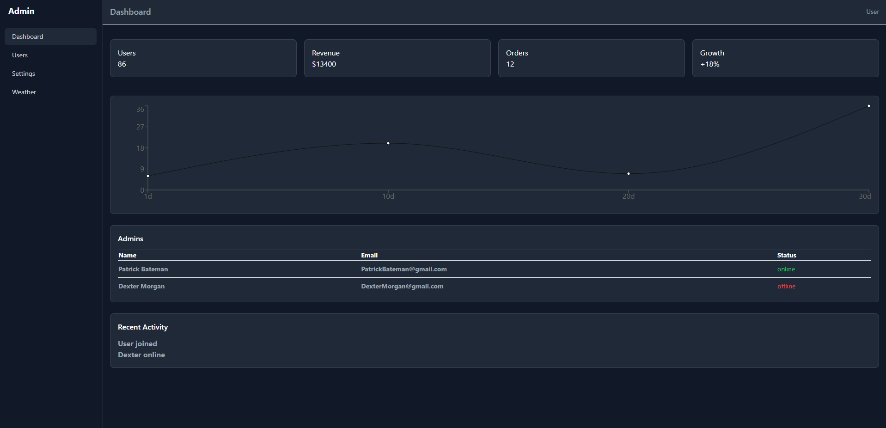
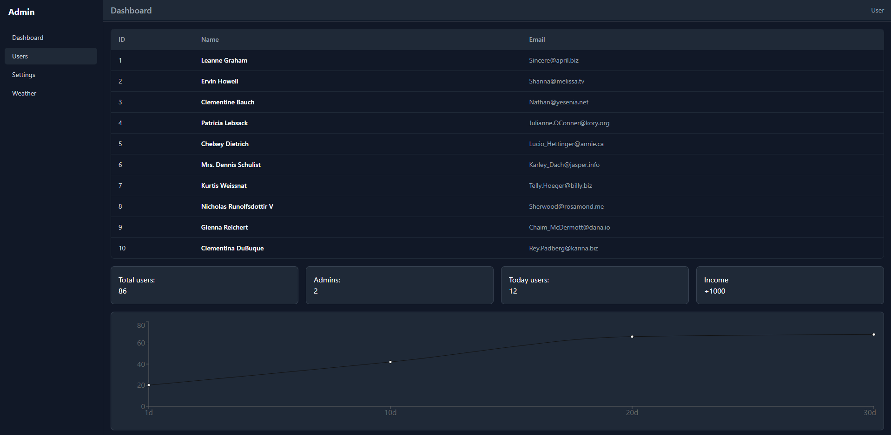
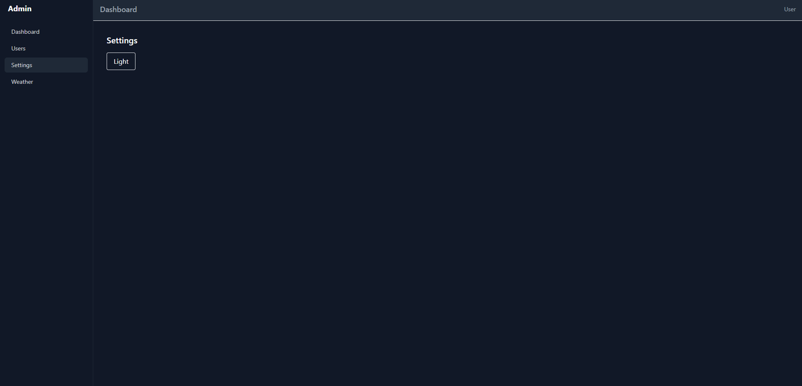
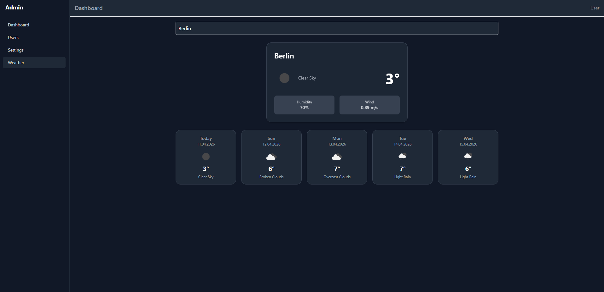

# My Project

Simple admin dashboard with users, weather and settings pages

## Stack

- React
- TypeScript
- TailwindCSS
- Axios
- React Router
- Recharts

## Features

- users table
- dashboard with chart
- dark/light theme
- weather search

## Additional

- debounce
- charts
- reusable widgets
- router

## Screenshots

## Run

npm install
npm run dev
